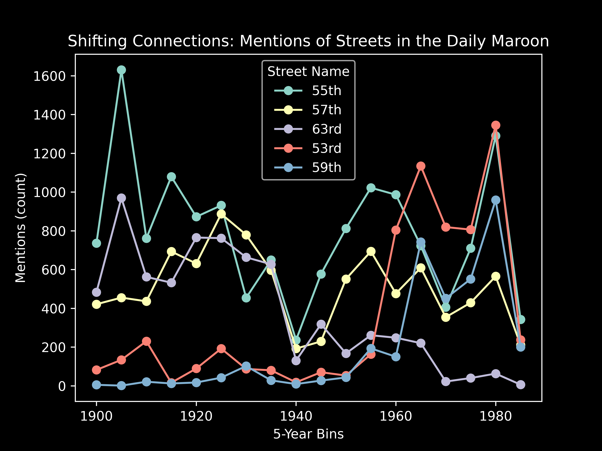

# Quick and Dirty Chicago Analysis

Last quarter, I helped with Chicago Centuries "Century on 63rd" project, which sought to document a century worth of changes along 63rd Street. While scouring newspapers for mentions of businesses and events along the street, I noticed something interesting: 63rd Street _seemingly_ was mentioned less over time. From my point of view, this decreased quantity of mentions likely reflected a decreased engagement with Woodlawn and areas south of the Midway Plaisance by UChicago students. But, alas -- I lacked good data to confirm this trend. 

Earlier this week, however, I discovered something interesting -- the University of Chicago library digitzed seemingly every copy of the (not-so) [Daily Maroon printed from 1902-1987](https://campub.lib.uchicago.edu/search/?f1-title=Daily%20Maroon), resulting in a source of text ripe for some basic content analysis. Being the hard working and dedicated student I am, I have blown off my actual work over the past 24ish hours and instead focused on doing a really quick content analysis to see if my intuition was right. And it was! Below is a quick plot showing the top 5 most mentioned streets (overall), and showing their mentions over time. (I have binned the values into five year groups to make the broad trends easier to see).

A few trends stand out immediately in this graph:

1. WW2 really dipped the mentions of streets! The 1940-1945 bin is pitiful. I haven't read many of the Daily Maroon articles from then, so I'm not sure why that is.

2. Urban Renewal in Hyde Park and Woodlawn -- around the 1950s and 1960s -- marks a shift in trends. In particular, we see mentions of 53rd skyrocket, while mentions of 55th decrease. This reflects the shift of businnesses from 55th to 53rd Street during renewal. 

3. 63rd Street has steadily decreasing mentions over time, with the "sharpest" bit of the change occuring during the racial changeover of the 50s. 

4. 59th street has a dramatic increase in mentions for. reasons. I'm actually not sure why that happens, but if you have a theory feel free to reach out!

For now, this repo mostly exists so I can send it to people who may find these trends interesting, but I'll likely continue playing with the text data as I have time, and maybe try to get better quality data via my own OCR attempts. I'm also certainly going to attempt to make a better visual out of this. 

# What are these files?

For people interested in spinning this project off into their own analysis, here's a quick rundown of what's present currently:

* `scripts`: The folder with all my scripts.
    * `scrape.py`: The script that does the scraping. Note that I'm making use of multithreading here, so this will not run on your system unless you have at least 5 cores available.
    * `MaroonHelper.py`: A somewhat unnecessary module I threw a few helper functions for this project into.
    * `Analysis.ipynb`: The script with my very basic analysis. 
* `data/transcripts`: The directory the scraped Daily Maroon text data is saved into.

Happy data analysis!